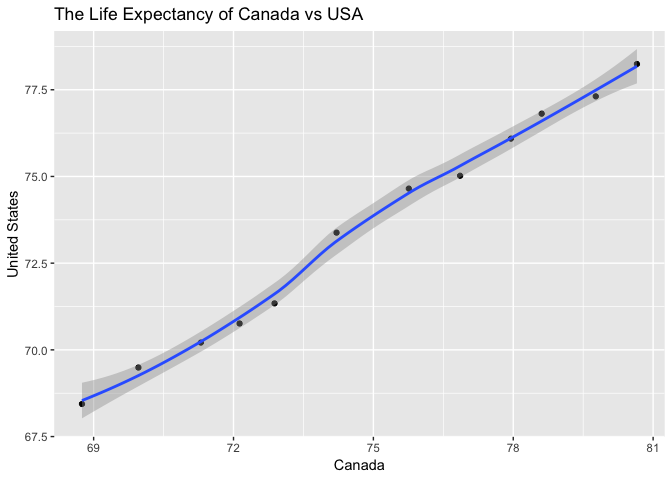
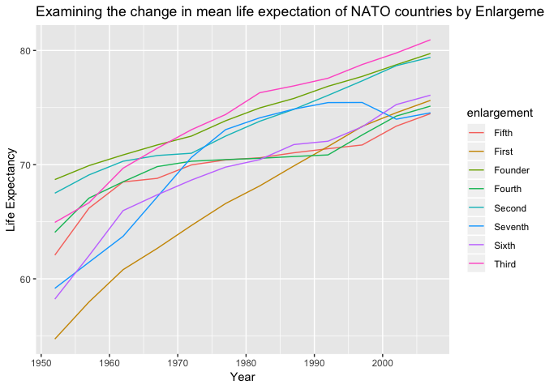

-   [Make a tibble with one row per year and columns for life expectancy
    for two or more
    countries.](#make-a-tibble-with-one-row-per-year-and-columns-for-life-expectancy-for-two-or-more-countries.)
-   [Explore database style joining in R with my `nato`
    `data.frame`](#explore-database-style-joining-in-r-with-my-nato-data.frame)
    -   [Let’s start by looking at outer
        joins.](#lets-start-by-looking-at-outer-joins.)
    -   [Let’s try an `anti_join` to see if `gapminder` is missing any
        NATO member
        countries.](#lets-try-an-anti_join-to-see-if-gapminder-is-missing-any-nato-member-countries.)
    -   [Let’s combine our knowledge, and see how the `pop` has changed
        for different `enlargement`s of NATO member
        countries](#lets-combine-our-knowledge-and-see-how-the-pop-has-changed-for-different-enlargements-of-nato-member-countries)

    suppressPackageStartupMessages(library(gapminder))
    suppressPackageStartupMessages(library(tidyverse))

Make a tibble with one row per year and columns for life expectancy for two or more countries.
----------------------------------------------------------------------------------------------

    tidy_lifeExp_data = gapminder %>%
      filter(country %in% c('United States', 'Canada', 'Turkey')) %>%
      select(year, lifeExp, country) %>%
      spread(country, lifeExp)
    knitr::kable(tidy_lifeExp_data)

<table>
<thead>
<tr class="header">
<th style="text-align: right;">year</th>
<th style="text-align: right;">Canada</th>
<th style="text-align: right;">Turkey</th>
<th style="text-align: right;">United States</th>
</tr>
</thead>
<tbody>
<tr class="odd">
<td style="text-align: right;">1952</td>
<td style="text-align: right;">68.750</td>
<td style="text-align: right;">43.585</td>
<td style="text-align: right;">68.440</td>
</tr>
<tr class="even">
<td style="text-align: right;">1957</td>
<td style="text-align: right;">69.960</td>
<td style="text-align: right;">48.079</td>
<td style="text-align: right;">69.490</td>
</tr>
<tr class="odd">
<td style="text-align: right;">1962</td>
<td style="text-align: right;">71.300</td>
<td style="text-align: right;">52.098</td>
<td style="text-align: right;">70.210</td>
</tr>
<tr class="even">
<td style="text-align: right;">1967</td>
<td style="text-align: right;">72.130</td>
<td style="text-align: right;">54.336</td>
<td style="text-align: right;">70.760</td>
</tr>
<tr class="odd">
<td style="text-align: right;">1972</td>
<td style="text-align: right;">72.880</td>
<td style="text-align: right;">57.005</td>
<td style="text-align: right;">71.340</td>
</tr>
<tr class="even">
<td style="text-align: right;">1977</td>
<td style="text-align: right;">74.210</td>
<td style="text-align: right;">59.507</td>
<td style="text-align: right;">73.380</td>
</tr>
<tr class="odd">
<td style="text-align: right;">1982</td>
<td style="text-align: right;">75.760</td>
<td style="text-align: right;">61.036</td>
<td style="text-align: right;">74.650</td>
</tr>
<tr class="even">
<td style="text-align: right;">1987</td>
<td style="text-align: right;">76.860</td>
<td style="text-align: right;">63.108</td>
<td style="text-align: right;">75.020</td>
</tr>
<tr class="odd">
<td style="text-align: right;">1992</td>
<td style="text-align: right;">77.950</td>
<td style="text-align: right;">66.146</td>
<td style="text-align: right;">76.090</td>
</tr>
<tr class="even">
<td style="text-align: right;">1997</td>
<td style="text-align: right;">78.610</td>
<td style="text-align: right;">68.835</td>
<td style="text-align: right;">76.810</td>
</tr>
<tr class="odd">
<td style="text-align: right;">2002</td>
<td style="text-align: right;">79.770</td>
<td style="text-align: right;">70.845</td>
<td style="text-align: right;">77.310</td>
</tr>
<tr class="even">
<td style="text-align: right;">2007</td>
<td style="text-align: right;">80.653</td>
<td style="text-align: right;">71.777</td>
<td style="text-align: right;">78.242</td>
</tr>
</tbody>
</table>

    tidy_lifeExp_data %>%
      ggplot(aes(x = Canada, y = `United States`)) +
        ggtitle("The Life Expectancy of Canada vs USA") +
        geom_point() +
        geom_smooth(method = "loess")

Explore database style joining in R with my `nato` `data.frame`
---------------------------------------------------------------

    # The following csv file was manually copied line-by-line from https://en.wikipedia.org/wiki/Member_states_of_NATO
    nato = read.csv('nato-countries.csv')

### Let’s start by looking at outer joins.

The following left join includes all columnns from `nato`, but only
contains values for countries belonging to NATO. As you can see from the
`head` of the joined `data.frame`, there are no `dateJoined` and
`enlargment` values for Afghanistan, since the country is not found in
the `nato` `data.frame`.

    gapminder_nato_left_join = left_join(gapminder, nato, by = "country") # An SQL style left join

    ## Warning: Column `country` joining factors with different levels, coercing
    ## to character vector

    head(gapminder_nato_left_join) %>%
      knitr::kable()

<table>
<thead>
<tr class="header">
<th style="text-align: left;">country</th>
<th style="text-align: left;">continent</th>
<th style="text-align: right;">year</th>
<th style="text-align: right;">lifeExp</th>
<th style="text-align: right;">pop</th>
<th style="text-align: right;">gdpPercap</th>
<th style="text-align: left;">dateJoined</th>
<th style="text-align: left;">enlargement</th>
</tr>
</thead>
<tbody>
<tr class="odd">
<td style="text-align: left;">Afghanistan</td>
<td style="text-align: left;">Asia</td>
<td style="text-align: right;">1952</td>
<td style="text-align: right;">28.801</td>
<td style="text-align: right;">8425333</td>
<td style="text-align: right;">779.4453</td>
<td style="text-align: left;">NA</td>
<td style="text-align: left;">NA</td>
</tr>
<tr class="even">
<td style="text-align: left;">Afghanistan</td>
<td style="text-align: left;">Asia</td>
<td style="text-align: right;">1957</td>
<td style="text-align: right;">30.332</td>
<td style="text-align: right;">9240934</td>
<td style="text-align: right;">820.8530</td>
<td style="text-align: left;">NA</td>
<td style="text-align: left;">NA</td>
</tr>
<tr class="odd">
<td style="text-align: left;">Afghanistan</td>
<td style="text-align: left;">Asia</td>
<td style="text-align: right;">1962</td>
<td style="text-align: right;">31.997</td>
<td style="text-align: right;">10267083</td>
<td style="text-align: right;">853.1007</td>
<td style="text-align: left;">NA</td>
<td style="text-align: left;">NA</td>
</tr>
<tr class="even">
<td style="text-align: left;">Afghanistan</td>
<td style="text-align: left;">Asia</td>
<td style="text-align: right;">1967</td>
<td style="text-align: right;">34.020</td>
<td style="text-align: right;">11537966</td>
<td style="text-align: right;">836.1971</td>
<td style="text-align: left;">NA</td>
<td style="text-align: left;">NA</td>
</tr>
<tr class="odd">
<td style="text-align: left;">Afghanistan</td>
<td style="text-align: left;">Asia</td>
<td style="text-align: right;">1972</td>
<td style="text-align: right;">36.088</td>
<td style="text-align: right;">13079460</td>
<td style="text-align: right;">739.9811</td>
<td style="text-align: left;">NA</td>
<td style="text-align: left;">NA</td>
</tr>
<tr class="even">
<td style="text-align: left;">Afghanistan</td>
<td style="text-align: left;">Asia</td>
<td style="text-align: right;">1977</td>
<td style="text-align: right;">38.438</td>
<td style="text-align: right;">14880372</td>
<td style="text-align: right;">786.1134</td>
<td style="text-align: left;">NA</td>
<td style="text-align: left;">NA</td>
</tr>
</tbody>
</table>

The following code only looks at the countries that are found in `nato`.

    gapminder_nato_right_join = right_join(gapminder, nato, by = "country") # An SQL style right join

    ## Warning: Column `country` joining factors with different levels, coercing
    ## to character vector

    head(gapminder_nato_right_join) %>%
      knitr::kable()

<table>
<thead>
<tr class="header">
<th style="text-align: left;">country</th>
<th style="text-align: left;">continent</th>
<th style="text-align: right;">year</th>
<th style="text-align: right;">lifeExp</th>
<th style="text-align: right;">pop</th>
<th style="text-align: right;">gdpPercap</th>
<th style="text-align: left;">dateJoined</th>
<th style="text-align: left;">enlargement</th>
</tr>
</thead>
<tbody>
<tr class="odd">
<td style="text-align: left;">Belgium</td>
<td style="text-align: left;">Europe</td>
<td style="text-align: right;">1952</td>
<td style="text-align: right;">68.00</td>
<td style="text-align: right;">8730405</td>
<td style="text-align: right;">8343.105</td>
<td style="text-align: left;">24 August 1949</td>
<td style="text-align: left;">Founder</td>
</tr>
<tr class="even">
<td style="text-align: left;">Belgium</td>
<td style="text-align: left;">Europe</td>
<td style="text-align: right;">1957</td>
<td style="text-align: right;">69.24</td>
<td style="text-align: right;">8989111</td>
<td style="text-align: right;">9714.961</td>
<td style="text-align: left;">24 August 1949</td>
<td style="text-align: left;">Founder</td>
</tr>
<tr class="odd">
<td style="text-align: left;">Belgium</td>
<td style="text-align: left;">Europe</td>
<td style="text-align: right;">1962</td>
<td style="text-align: right;">70.25</td>
<td style="text-align: right;">9218400</td>
<td style="text-align: right;">10991.207</td>
<td style="text-align: left;">24 August 1949</td>
<td style="text-align: left;">Founder</td>
</tr>
<tr class="even">
<td style="text-align: left;">Belgium</td>
<td style="text-align: left;">Europe</td>
<td style="text-align: right;">1967</td>
<td style="text-align: right;">70.94</td>
<td style="text-align: right;">9556500</td>
<td style="text-align: right;">13149.041</td>
<td style="text-align: left;">24 August 1949</td>
<td style="text-align: left;">Founder</td>
</tr>
<tr class="odd">
<td style="text-align: left;">Belgium</td>
<td style="text-align: left;">Europe</td>
<td style="text-align: right;">1972</td>
<td style="text-align: right;">71.44</td>
<td style="text-align: right;">9709100</td>
<td style="text-align: right;">16672.144</td>
<td style="text-align: left;">24 August 1949</td>
<td style="text-align: left;">Founder</td>
</tr>
<tr class="even">
<td style="text-align: left;">Belgium</td>
<td style="text-align: left;">Europe</td>
<td style="text-align: right;">1977</td>
<td style="text-align: right;">72.80</td>
<td style="text-align: right;">9821800</td>
<td style="text-align: right;">19117.974</td>
<td style="text-align: left;">24 August 1949</td>
<td style="text-align: left;">Founder</td>
</tr>
</tbody>
</table>

### Let’s try an `anti_join` to see if `gapminder` is missing any NATO member countries.

    anti_join(nato, gapminder, by = "country") %>%
      knitr::kable()

    ## Warning: Column `country` joining factors with different levels, coercing
    ## to character vector

<table>
<thead>
<tr class="header">
<th style="text-align: left;">country</th>
<th style="text-align: left;">dateJoined</th>
<th style="text-align: left;">enlargement</th>
</tr>
</thead>
<tbody>
<tr class="odd">
<td style="text-align: left;">Luxembourg</td>
<td style="text-align: left;">24 August 1949</td>
<td style="text-align: left;">Founder</td>
</tr>
<tr class="even">
<td style="text-align: left;">Estonia</td>
<td style="text-align: left;">29 March 2004</td>
<td style="text-align: left;">Fifth</td>
</tr>
<tr class="odd">
<td style="text-align: left;">Latvia</td>
<td style="text-align: left;">29 March 2004</td>
<td style="text-align: left;">Fifth</td>
</tr>
<tr class="even">
<td style="text-align: left;">Lithuania</td>
<td style="text-align: left;">29 March 2004</td>
<td style="text-align: left;">Fifth</td>
</tr>
<tr class="odd">
<td style="text-align: left;">Slovakia</td>
<td style="text-align: left;">29 March 2004</td>
<td style="text-align: left;">Fifth</td>
</tr>
</tbody>
</table>

Interestingly, the above five Eastern European countries that are
missing from the `gapminder` dataset.

### Let’s combine our knowledge, and see how the `pop` has changed for different `enlargement`s of NATO member countries

    gapminder_nato_right_join %>%
      select(enlargement, year, lifeExp) %>% # We only care about these three variables
      group_by(year, enlargement) %>%
      summarise(lifeExp = mean(lifeExp)) %>% # We want to gather the means of lifeExp per enlargement
      arrange(enlargement) %>% # Sort by enlargement
      ggplot(aes(year, lifeExp, colour = enlargement)) +
        ggtitle("Examining the change in mean life expectation of NATO countries by Enlargement") +
        geom_line()

    ## Warning: Removed 2 rows containing missing values (geom_path).

