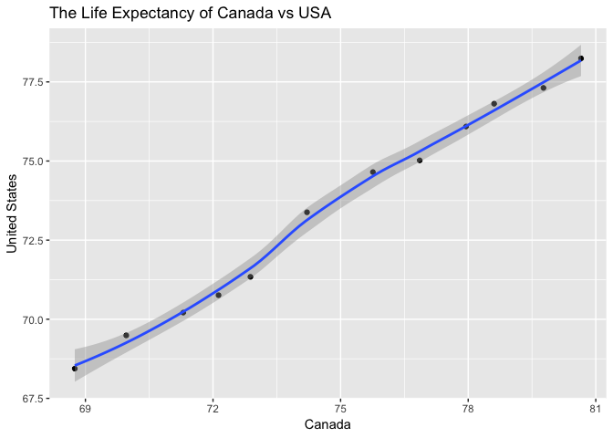
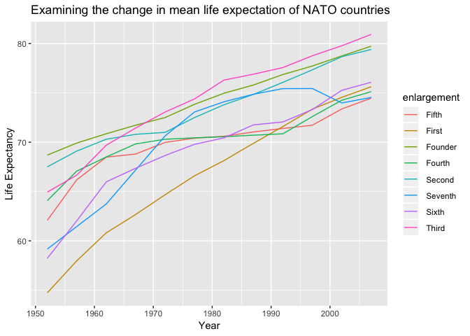

Homework 04: Tidy data and joins
================
Emre Erhan
October 9, 2018

``` r
suppressPackageStartupMessages(library(gapminder))
suppressPackageStartupMessages(library(tidyverse))
```

## Make a tibble with one row per year and columns for life expectancy for two or more countries.

``` r
tidy_lifeExp_data = gapminder %>%
  filter(country %in% c('United States', 'Canada', 'Turkey')) %>%
  select(year, lifeExp, country) %>%
  spread(country, lifeExp)
knitr::kable(tidy_lifeExp_data)
```

| year | Canada | Turkey | United States |
| ---: | -----: | -----: | ------------: |
| 1952 | 68.750 | 43.585 |        68.440 |
| 1957 | 69.960 | 48.079 |        69.490 |
| 1962 | 71.300 | 52.098 |        70.210 |
| 1967 | 72.130 | 54.336 |        70.760 |
| 1972 | 72.880 | 57.005 |        71.340 |
| 1977 | 74.210 | 59.507 |        73.380 |
| 1982 | 75.760 | 61.036 |        74.650 |
| 1987 | 76.860 | 63.108 |        75.020 |
| 1992 | 77.950 | 66.146 |        76.090 |
| 1997 | 78.610 | 68.835 |        76.810 |
| 2002 | 79.770 | 70.845 |        77.310 |
| 2007 | 80.653 | 71.777 |        78.242 |

``` r
tidy_lifeExp_data %>%
  ggplot(aes(x = Canada, y = `United States`)) +
    ggtitle("The Life Expectancy of Canada vs USA") +
    geom_point() +
    geom_smooth(method = "loess")
```

<!-- -->

## Explore database style joining in R with my `nato` `data.frame`

``` r
# The following csv file was manually copied line-by-line from https://en.wikipedia.org/wiki/Member_states_of_NATO
nato = read.csv('nato-countries.csv')
```

### Let’s start by looking at outer joins.

The following left join includes all columnns from `nato`, but only
contains values for countries belonging to NATO. As you can see from the
`head` of the joined `data.frame`, there are no `dateJoined` and
`enlargment` values for Afghanistan, since the country is not found in
the `nato`
`data.frame`.

``` r
gapminder_nato_left_join = left_join(gapminder, nato, by = "country") # An SQL style left join
```

    ## Warning: Column `country` joining factors with different levels, coercing
    ## to character vector

``` r
head(gapminder_nato_left_join) %>%
  knitr::kable()
```

| country     | continent | year | lifeExp |      pop | gdpPercap | dateJoined | enlargement |
| :---------- | :-------- | ---: | ------: | -------: | --------: | :--------- | :---------- |
| Afghanistan | Asia      | 1952 |  28.801 |  8425333 |  779.4453 | NA         | NA          |
| Afghanistan | Asia      | 1957 |  30.332 |  9240934 |  820.8530 | NA         | NA          |
| Afghanistan | Asia      | 1962 |  31.997 | 10267083 |  853.1007 | NA         | NA          |
| Afghanistan | Asia      | 1967 |  34.020 | 11537966 |  836.1971 | NA         | NA          |
| Afghanistan | Asia      | 1972 |  36.088 | 13079460 |  739.9811 | NA         | NA          |
| Afghanistan | Asia      | 1977 |  38.438 | 14880372 |  786.1134 | NA         | NA          |

The following code only looks at the countries that are found in
`nato`.

``` r
gapminder_nato_right_join = right_join(gapminder, nato, by = "country") # An SQL style right join
```

    ## Warning: Column `country` joining factors with different levels, coercing
    ## to character vector

``` r
head(gapminder_nato_right_join) %>%
  knitr::kable()
```

| country | continent | year | lifeExp |     pop | gdpPercap | dateJoined     | enlargement |
| :------ | :-------- | ---: | ------: | ------: | --------: | :------------- | :---------- |
| Belgium | Europe    | 1952 |   68.00 | 8730405 |  8343.105 | 24 August 1949 | Founder     |
| Belgium | Europe    | 1957 |   69.24 | 8989111 |  9714.961 | 24 August 1949 | Founder     |
| Belgium | Europe    | 1962 |   70.25 | 9218400 | 10991.207 | 24 August 1949 | Founder     |
| Belgium | Europe    | 1967 |   70.94 | 9556500 | 13149.041 | 24 August 1949 | Founder     |
| Belgium | Europe    | 1972 |   71.44 | 9709100 | 16672.144 | 24 August 1949 | Founder     |
| Belgium | Europe    | 1977 |   72.80 | 9821800 | 19117.974 | 24 August 1949 | Founder     |

### Let’s try an `anti_join` to see if `gapminder` is missing any NATO member countries.

``` r
anti_join(nato, gapminder, by = "country") %>%
  knitr::kable()
```

    ## Warning: Column `country` joining factors with different levels, coercing
    ## to character vector

| country    | dateJoined     | enlargement |
| :--------- | :------------- | :---------- |
| Luxembourg | 24 August 1949 | Founder     |
| Estonia    | 29 March 2004  | Fifth       |
| Latvia     | 29 March 2004  | Fifth       |
| Lithuania  | 29 March 2004  | Fifth       |
| Slovakia   | 29 March 2004  | Fifth       |

Interestingly, the above five Eastern European countries that are
missing from the `gapminder`
dataset.

### Let’s combine our knowledge, and see how the `pop` has changed for different `enlargement` of NATO member countries

``` r
gapminder_nato_right_join %>%
  select(enlargement, year, lifeExp) %>% # We only care about these three variables
  group_by(year, enlargement) %>%
  summarise(lifeExp = mean(lifeExp)) %>% # We want to gather the means of lifeExp per enlargement
  arrange(enlargement) %>% # Sort by enlargement
  ggplot(aes(year, lifeExp, colour = enlargement)) +
    ggtitle("Examining the change in mean life expectation of NATO countries by Enlargement") +
    ylab("Life Expectancy") + 
    xlab("Year") +
    geom_line()
```

    ## Warning: Removed 2 rows containing missing values (geom_path).

<!-- -->
